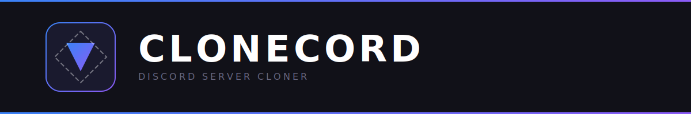
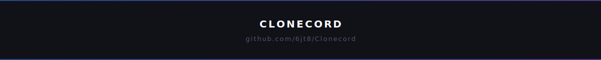

<p align="center">
  
</p>

<p align="center">
  <strong>A <a href="https://github.com/Vendicated/Vencord">Vencord</a> plugin that lets you clone Discord servers.</strong>
</p>

<p align="center">
  <a href="https://github.com/6jt8/Clonecord/actions/workflows/ci.yml">
    
  </a>
  <a href="https://github.com/6jt8/Clonecord/releases">
    
  </a>
  <a href="https://github.com/6jt8/Clonecord/blob/main/LICENSE">
    
  </a>
  <a href="https://discord.gg/">
    
  </a>
</p>

---

<p align="center">
  <strong>⚠️ Disclaimer:</strong> This project is for educational purposes only. Using this plugin may violate Discord's <a href="https://discord.com/terms">Terms of Service</a> and <a href="https://discord.com/guidelines">Community Guidelines</a>, which can result in permanent account termination. Use at your own risk.
</p>

---

<h2 align="center">Features</h2>

<table align="center">
  <tr>
    <td align="center">
      
      <br/>
      <strong>Channels</strong><br/>
      <sub>Text, Voice, Forum</sub>
    </td>
    <td align="center">
      
      <br/>
      <strong>Roles</strong><br/>
      <sub>Permissions &amp; Icons</sub>
    </td>
    <td align="center">
      
      <br/>
      <strong>Settings</strong><br/>
      <sub>Name, Icon, Banner</sub>
    </td>
    <td align="center">
      
      <br/>
      <strong>Onboarding</strong><br/>
      <sub>Community Config</sub>
    </td>
    <td align="center">
      
      <br/>
      <strong>Assets</strong><br/>
      <sub>Stickers &amp; Sounds</sub>
    </td>
  </tr>
</table>

<h2 align="center">Installation</h2>

<div align="center">

```bash
cd path/to/Vencord/src/userplugins
git clone https://github.com/6jt8/Clonecord.git
```

Rebuild Vencord, restart Discord, and enable **Clonecord** in `Settings > Vencord > Plugins`.

</div>

<p align="center">
  <strong>Note:</strong> Do NOT commit <code>tsconfig.json</code> — it is gitignored because it overrides Vencord's module resolution.
</p>

<h2 align="center">Usage</h2>

<p align="center">Right-click any server → <strong>Clone Server</strong> → choose what to clone → watch the progress bar.</p>

<h2 align="center">Development</h2>

<p align="center">See <a href="CONTRIBUTING.md">CONTRIBUTING.md</a> for setup instructions and guidelines.</p>

<h2 align="center">Support</h2>

<p align="center">
  <a href="https://github.com/6jt8/Clonecord/issues/new?template=bug_report.yml">Report a Bug</a> ·
  <a href="https://github.com/6jt8/Clonecord/issues/new?template=feature_request.yml">Request a Feature</a> ·
  <a href="https://discord.gg/SY8f5xPxBj">Discord Server</a>
</p>

---

<p align="center">
  <sub>Made with ❤️ by <a href="https://github.com/6jt8">6jt8</a></sub>
</p>

<p align="center">
  
</p>
